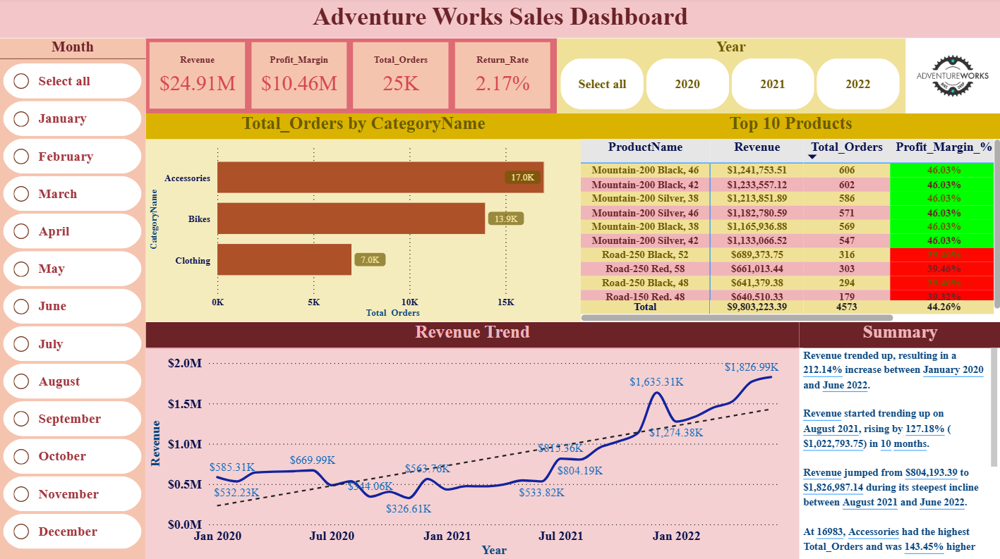
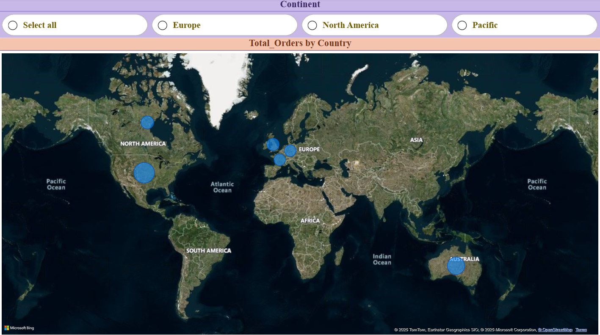

# 💡 Power Bi Project by Yash Yennewar

# Adventure_Works_Bikes_Project_Analysis
A Power BI project analyzing Adventure Works sales data to uncover revenue trends, product performance, and customer order insights through interactive dashboards.

## 🔗 Project Link :

[Adventure_Works_Bikes_Project_Analysis](Adventure_Works_Bikes_Project_Analysis.pbix)

---

## 🌍 Overview :
This Power BI project analyzes Adventure Works sales data, focusing on revenue growth, product performance, and customer orders.
The dashboard highlights key KPIs, interactive filters, and visual storytelling to uncover business insights.

---

## 🛠️ Skills & Tools :
- Power Query – Data cleaning & preparation.
- Data Modeling & DAX (KPIs, measures).
- Interactive Visualizations (charts, slicers, drill-through).
- Business Intelligence Reporting

---

## 🎯 Key Insights :
- Revenue Growth: +212.14% (Jan 2020 → Jun 2022).
- Strong Surge: +127.18% ($1M+) in 10 months (Aug 2021 → Jun 2022).
- Category Orders: Accessories (16,983) > Bikes (13,929) > Clothing (6,976).
- Top Products: Mountain-200 series leads with >$1.2M revenue each.

---

## 📚 Learnings :
- Designing BI dashboards that tell a story.
- Highlighting growth trends & product performance.
- Building decision-support visuals in Power BI.

---

## 📸 Screenshots :

---
