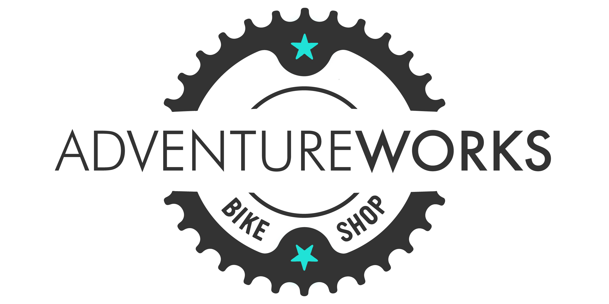
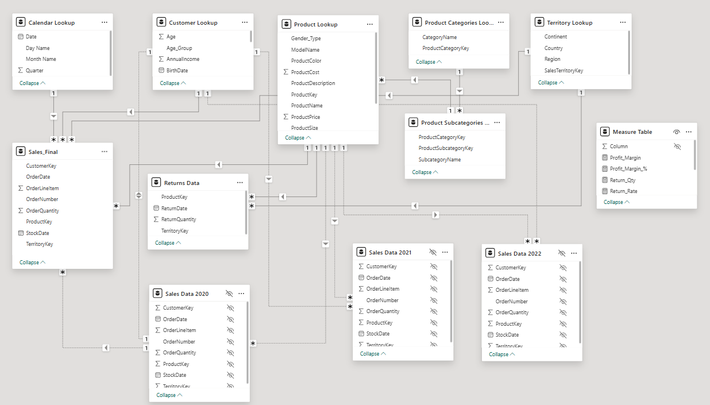
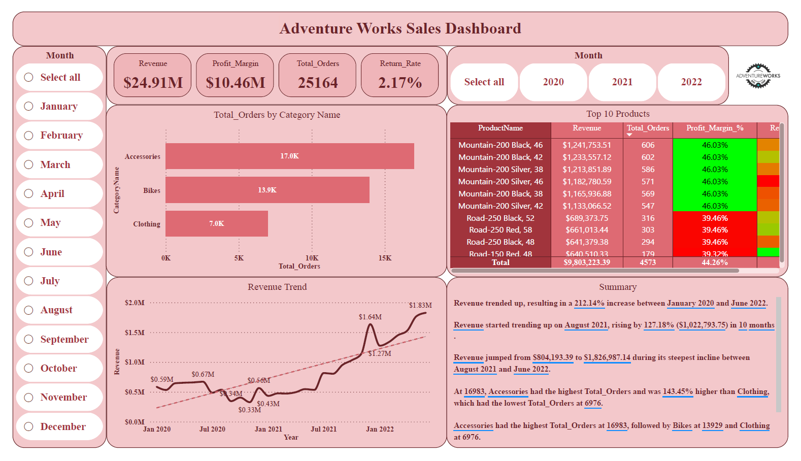
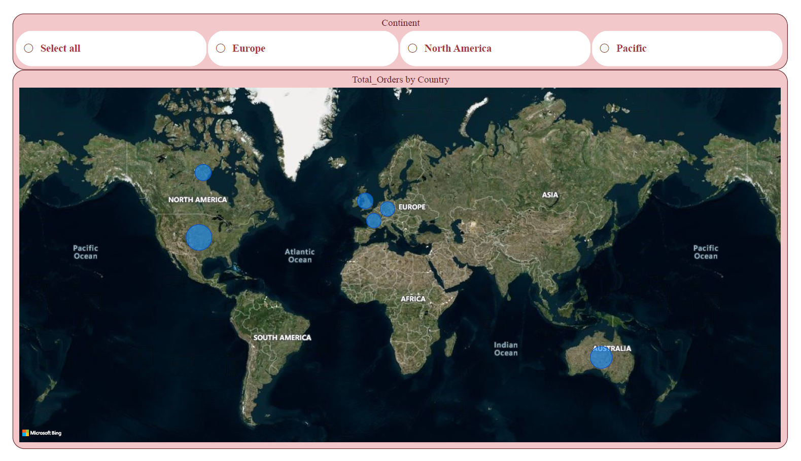

# 💡 Power Bi Project by Yash Yennewar

# Adventure_Works_Bikes_Project_Analysis
A Power BI project analyzing Adventure Works sales data to uncover revenue trends, product performance, and customer order insights through interactive dashboards.

## 🔗 Project Link :

[Adventure_Works_Bikes_Project_Analysis](Adventure_Works_Bikes_Project_Analysis.pbix)



---

## 🌍 Overview :
This Power BI project analyzes Adventure Works sales data, focusing on revenue growth, product performance, and customer orders.
The dashboard highlights key KPIs, interactive filters, and visual storytelling to uncover business insights.

---

## 🛠️ Skills & Tools :
### 🔹 Data Preparation (Power Query)  
- **Sales Tables** → Appended 2020–2022 data into **SALES_FINAL**  
- **Product & Customer** → Added flags (`Is_Parent?`), segments (`Income_Level`, `Age_Group`), fixed data types.
- **Calendar** → Derived Month, Day, Quarter for time intelligence.

---

### 🔹 Data Modeling  
- Built **star schema** with **SALES_FINAL** as fact table + dimension lookups  
- Set proper **1:* relationships**  
- Created a **Measure Table** for KPIs  

## 📸 Data Model Screenshot : 
  

---

### DAX (Data Analysis Expressions)  
Defined key business measures using DAX : 
```
DAX
Revenue = SUMX(Sales_Final,Sales_Final[OrderQuantity]*RELATED('Product Lookup'[ProductPrice]))
Total_Cost = SUMX(Sales_Final,Sales_Final[OrderQuantity]*RELATED('Product Lookup'[ProductCost]))
Profit_Margin = [Revenue] - [Total_Cost]
```

**Functions Used in Measures** :

- **SUMX** → For row-by-row calculations of Revenue and Cost.  
- **RELATED** → To fetch product details like price and cost from dimension tables.  
- **COUNTROWS** → To calculate total number of orders.  
- **DIVIDE** → For safe division while avoiding divide-by-zero errors.  
- **IF** (used in conditional KPIs) → For logic-based calculations (e.g., flagging performance trends).

---

### 🔹 Visuals & Reporting  
- Interactive charts, KPIs, slicers, drill-through  
- Insights: revenue, orders, distribution, trends  

---

### 🔹 Row-Level Security (RLS)
To ensure **restricted access**, I implemented **Row-Level Security** in Power BI based on **regional managers**.
- Roles: **Europe Manager**, **North America Manager** and **Pacific Managers**.
- Each sees **only their region’s data**  
- Restricted from unrelated visuals, tables, or model views.
- **Power BI Security** provides **fine-grained control** over **data access** and **dashboard permissions**.

---
 
## 🎯 Key Insights :
- Revenue Growth: +212.14% (Jan 2020 → Jun 2022).
- Strong Surge: +127.18% ($1M+) in 10 months (Aug 2021 → Jun 2022).
- Category Orders: Accessories (16,983) > Bikes (13,929) > Clothing (6,976).
- Top Products: Mountain-200 series leads with >$1.2M revenue each.

---

## 📚 Learnings :
- Designing BI dashboards that tell a story.
- Highlighting growth trends & product performance.
- Building decision-support visuals in Power BI.

---

## 📸 Screenshots :



---
